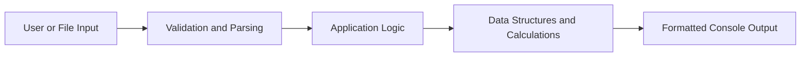

<div align="center">

# C++ Console Application Portfolio

### Three practical console applications focused on modular design, data processing and problem solving


[Applications](#applications) · [Documentation](#project-documentation) · [Build and Run](#build-and-run) · [Concepts](#concepts-demonstrated)

</div>

---

## Overview

This portfolio contains three standalone C++ console applications that demonstrate formatted output, user-input processing, reusable functions, financial calculations, file handling and data aggregation with standard-library containers.

The applications were originally developed through **CS 210: Programming Languages** and are presented here as a unified C++ application portfolio.

| Application | Purpose | Main Concepts |
|---|---|---|
| Dual Clock | Displays and adjusts synchronized 12-hour and 24-hour clocks | Functions, references, validation, loops and formatting |
| Airgead Banking | Compares compound-interest growth with and without monthly deposits | Structures, vectors, iteration and financial calculations |
| Corner Grocer | Reads grocery records and reports item frequencies | File input, maps, searching and histograms |

## Applications

### 1. [Dual Clock Application](./ClockAppRP.cpp)

Accepts an initial time in 24-hour format, displays equivalent 12-hour and 24-hour clocks and provides menu options for adding hours, minutes or seconds.

**Highlights:** time conversion, string parsing, input validation, pass-by-reference parameters and formatted console output.

### 2. [Airgead Banking Investment Calculator](./airgeadbankingRP.cpp)

Calculates monthly compound-interest growth and generates reports comparing an investment with and without recurring monthly deposits.

**Highlights:** custom structures, vectors, reusable calculation functions, monthly iteration and tabular financial reporting.

### 3. [Corner Grocer Inventory Analyzer](./GroceryAppRP.cpp)

Reads grocery purchase records, counts item frequencies and allows users to search for an item, print every frequency or display a text-based histogram.

**Highlights:** file input, `std::map`, frequency aggregation, searching, menu-driven logic and simple data visualization.

The repository includes [`CS210_Project_Three_Input_File.txt`](./CS210_Project_Three_Input_File.txt), the sample dataset required by the Corner Grocer application.

## Project Documentation

Supporting documentation is available for the application designs, program flows and project requirements.

| Document | Description | Link |
|---|---|---|
| Complete Portfolio Documentation | Overview of all three applications, including responsibilities, data structures, execution flow and potential improvements | [View Markdown](./docs/CS-210-Project-Documentation.md) · [Download Markdown](./docs/CS-210-Project-Documentation.md?raw=1) |
| Airgead Banking Flowcharts | Word document containing the banking application's design flowcharts and planning materials | [Download DOCX](./docs/airgeadbaking%20flowsheets%20RP(1).docx?raw=1) |
| Corner Grocer Documentation | Word document containing supporting documentation for the grocery inventory application | [Download DOCX](./docs/Groceryapp%20documentation.docx?raw=1) |

## Application Design



Each application separates major responsibilities into focused functions instead of placing the complete workflow inside `main()`.

## Build and Run

A C++17-compatible compiler is recommended.

### 1. Clone the repository

```bash
git clone https://github.com/rypeguero/cpp-console-application-portfolio.git
cd cpp-console-application-portfolio
```

### 2. Compile and run an application

#### Dual Clock

```bash
g++ -std=c++17 ClockAppRP.cpp -o clock-app
./clock-app
```

#### Airgead Banking

```bash
g++ -std=c++17 airgeadbankingRP.cpp -o banking-app
./banking-app
```

#### Corner Grocer

Keep `CS210_Project_Three_Input_File.txt` in the same working directory as the executable.

```bash
g++ -std=c++17 GroceryAppRP.cpp -o grocery-app
./grocery-app
```

On Windows, run the generated executable with `clock-app.exe`, `banking-app.exe` or `grocery-app.exe`.

## Repository Structure

```text
cpp-console-application-portfolio/
├── ClockAppRP.cpp
├── airgeadbankingRP.cpp
├── GroceryAppRP.cpp
├── CS210_Project_Three_Input_File.txt
├── README.md
└── docs/
    ├── CS-210-Project-Documentation.md
    ├── airgeadbaking flowsheets RP(1).docx
    └── Groceryapp documentation.docx
```

## Concepts Demonstrated

`C++` · `Modular Programming` · `Functions` · `Pass by Reference` · `Structures` · `Vectors` · `Maps` · `File I/O` · `Input Validation` · `Exception Handling` · `Formatted Output` · `Data Aggregation`

## Portfolio Context

These applications represent foundational C++ development and show progression from formatted console interaction to structured financial calculations and file-driven data analysis.

They are educational portfolio projects rather than production applications. Useful future improvements include automated tests, stronger malformed-input recovery, portable CMake builds and further separation between domain logic and console presentation.

---

<div align="center">

**Ryan A. Peguero · Computer Science · Software Engineering**

</div>