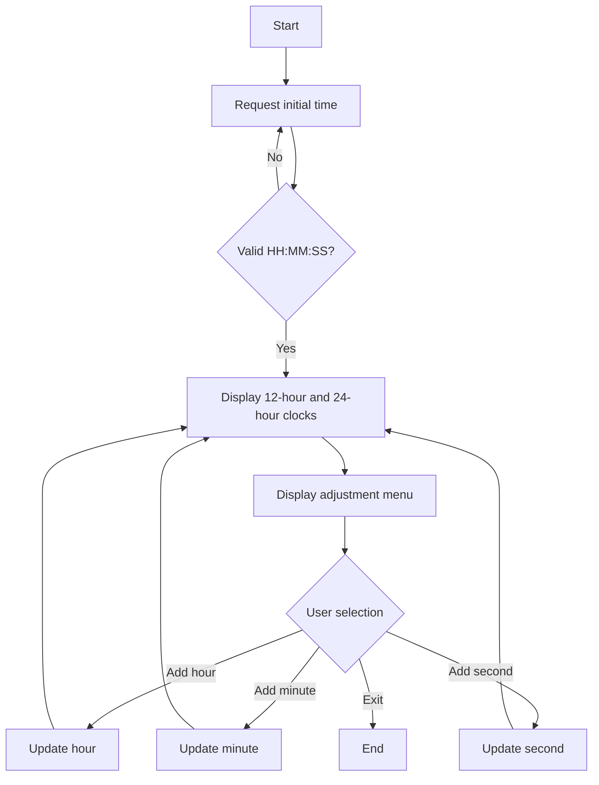
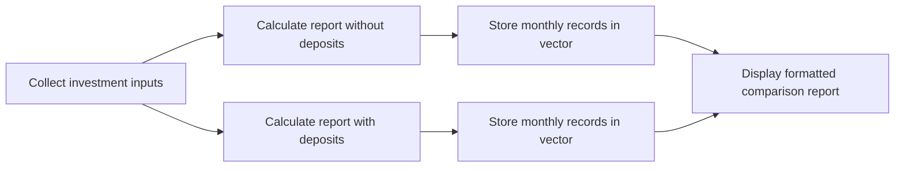

# CS 210 Programming Languages: Project Documentation

## Portfolio Summary

This repository contains three C++ console applications developed to practice modular programming, formatted output, input processing, file handling, standard-library containers, and requirements-based problem solving.

| Application | Primary Purpose | Core C++ Concepts |
|---|---|---|
| Dual Clock Application | Displays and modifies synchronized 12-hour and 24-hour clocks | Functions, references, validation, loops, formatting, conditionals |
| Airgead Banking Calculator | Models compound-interest growth with and without monthly deposits | Structures, vectors, functions, iteration, financial calculations |
| Corner Grocer Inventory Analyzer | Reads grocery records and reports item frequencies | File input, maps, searching, aggregation, histograms |

---

## 1. Dual Clock Application

### Purpose

The clock application accepts an initial time in 24-hour format and displays the same time using both 12-hour and 24-hour notation. A menu allows the user to add one hour, one minute, or one second before refreshing the displays.

### File

- [`ClockAppRP.cpp`](../ClockAppRP.cpp)

### Main Responsibilities

- accept an initial `HH:MM:SS` value
- validate hour, minute, and second ranges
- convert 24-hour values into 12-hour AM/PM notation
- render two formatted clock displays
- provide a menu for adjusting the current time
- continue until the user selects the exit option

### Functional Flow



### Key Functions

| Function | Responsibility |
|---|---|
| `printClockBorder()` | Draws the borders around both clock displays |
| `printClocks()` | Converts and formats the current time in both clock formats |
| `inputInitialTime()` | Reads and validates the starting time |
| `printMainMenu()` | Displays the available clock operations |
| `processUserInput()` | Processes the selected menu action and updates time values |

### Concepts Demonstrated

- pass-by-reference parameters
- formatted output with `setw()` and `setfill()`
- string parsing with `find()`, `substr()`, and `stoi()`
- exception handling during input conversion
- menu-driven control flow
- time-format conversion

---

## 2. Airgead Banking Investment Calculator

### Purpose

The banking application calculates investment growth over a user-selected number of years. It produces two reports so the user can compare compound-interest growth without monthly deposits against growth with recurring monthly deposits.

### File

- [`airgeadbankingRP.cpp`](../airgeadbankingRP.cpp)

### User Inputs

- initial investment amount
- monthly deposit amount
- annual interest rate
- number of years

### Calculation Model

The application converts the annual interest rate into a monthly rate and evaluates each month in the investment period.

```text
Monthly Interest Rate = Annual Interest Rate / 100 / 12
Monthly Total = Opening Balance + Monthly Deposit
Monthly Interest = Monthly Total × Monthly Interest Rate
Closing Balance = Monthly Total + Monthly Interest
```

### Data Model

The `InvestmentMonth` structure stores the calculation results for each month:

| Field | Meaning |
|---|---|
| `month` | Sequential month number |
| `openingAmount` | Balance at the beginning of the month |
| `depositedAmount` | Monthly contribution applied during the month |
| `total` | Opening amount plus the contribution |
| `interest` | Interest earned during the month |
| `closingBalance` | Ending balance after interest |

### Functional Flow



### Key Functions

| Function | Responsibility |
|---|---|
| `calculateInvestmentDetails()` | Calculates and stores monthly investment results |
| `displayInvestmentReport()` | Formats and prints selected report milestones |

### Concepts Demonstrated

- structures for grouped data
- vectors for sequential records
- compound-interest calculations
- reusable functions
- conditional behavior through Boolean parameters
- tabular console formatting

---

## 3. Corner Grocer Inventory Analyzer

### Purpose

The grocery application reads item names from an input file and counts how often each item appears. Users can search for one item, display all item frequencies, or print a text-based histogram.

### Files

- [`GroceryAppRP.cpp`](../GroceryAppRP.cpp)
- required runtime input: `CS210_Project_Three_Input_File.txt`

### Available Operations

| Menu Option | Result |
|---|---|
| Look up item frequency | Searches for an item and returns its count |
| Print all frequencies | Displays every item and its numeric frequency |
| Print histogram | Displays each item followed by one `*` per occurrence |
| Exit | Closes the program |

### Data Processing Flow

```mermaid
flowchart TD
    A[Open grocery input file] --> B{File available?}
    B -->|No| C[Display error and exit]
    B -->|Yes| D[Read each item]
    D --> E[Increment item count in map]
    E --> F[Display menu]
    F --> G{Selection}
    G -->|Lookup| H[Search map]
    G -->|List| I[Print numeric frequencies]
    G -->|Histogram| J[Print star histogram]
    G -->|Exit| K[End]
    H --> F
    I --> F
    J --> F
```



### Key Functions

| Function | Responsibility |
|---|---|
| `readInputFile()` | Reads grocery records and builds the frequency map |
| `getItemFrequency()` | Searches for one requested item |
| `printAllFrequencies()` | Prints all item counts |
| `printHistogram()` | Produces the text-based frequency visualization |

### Concepts Demonstrated

- reading data with `ifstream`
- frequency counting with `std::map`
- searching with `find()`
- range-based loops
- simple data visualization
- file-error handling

---

## Building and Running

A C++17-compatible compiler is recommended.

### Clock Application

```bash
g++ -std=c++17 ClockAppRP.cpp -o clock-app
./clock-app
```

### Banking Application

```bash
g++ -std=c++17 airgeadbankingRP.cpp -o banking-app
./banking-app
```

### Grocery Application

Place `CS210_Project_Three_Input_File.txt` in the same working directory as the executable, then run:

```bash
g++ -std=c++17 GroceryAppRP.cpp -o grocery-app
./grocery-app
```

On Windows, run the generated `.exe` file instead of using the `./` command.

---

## Software Engineering Practices Demonstrated

- decomposing requirements into focused functions
- separating calculations from presentation logic
- selecting standard-library containers for the problem
- validating user and file input
- formatting output for usability
- using descriptive data structures
- documenting responsibilities and execution flow

## Potential Improvements

These applications represent foundational C++ work. Useful future enhancements include:

- stronger recovery from malformed user input
- automated unit tests for calculation and validation functions
- classes that separate domain logic from console interaction
- consistent naming aligned with modern C++ conventions
- CMake build configuration
- command-line arguments for selecting data files
- persistence of the grocery frequency backup data

## Repository File Map

```text
CS-210-Programming-Languages/
├── ClockAppRP.cpp
├── airgeadbankingRP.cpp
├── GroceryAppRP.cpp
├── README.md
└── docs/
    └── CS-210-Project-Documentation.md
```

---

**Author:** Ryan A. Peguero  
**Area:** Computer Science and Software Engineering  
**Course:** CS 210 Programming Languages
